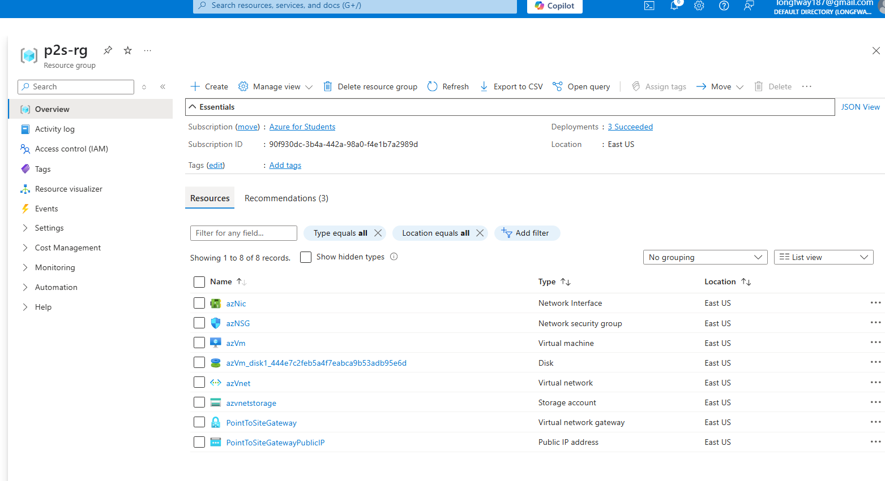

# Azure-Point-To-Site-VPN-Connection
🚀 Azure Virtual Network & VPN Gateway Deployment Project

This project demonstrates the design, deployment, and testing of a secure **Azure Virtual Network (VNet)** connected to an on-premises environment via an **Azure VPN Gateway (P2S VPN)**.  
It includes **Infrastructure as Code (IaC) with Bicep**, **static route configuration**, and **client VPN connection testing** on Windows.

---

## 📑 Table of Contents

- [📖 Project Overview](#-project-overview)
- [🗺️ Network Topology](#-network-topology)
- [🛠️ Technologies Used](#-technologies-used)
- [🚀 Deployment Steps](#-deployment-steps)
- [📸 Screenshots](#-screenshots)

---

## 📖 Project Overview

The purpose of this lab project is to create a secure, scalable, and testable VPN infrastructure within Azure, enabling **Point-to-Site (P2S)** VPN connections to an Azure Virtual Network (VNet).  
It includes route configuration, client connection testing, and captures logs and troubleshooting insights.

---

## 🗺️ Network Topology

+-----------------------------+
| Azure Virtual Network |
| +-----------------------+ |
| | VPN Gateway (P2S) | |
| | Public IP | |
| | Subnet: GatewaySubnet| |
| +-----------------------+ |
| | (P2S VPN) |
+---------+---------+---------+
| VPN Tunnel
+---------+---------+---------+
| Windows Client VM |
+----------------------------+


---

## 🛠️ Technologies Used

- **Microsoft Azure**
- **Azure Virtual Network**
- **Azure VPN Gateway (Point-to-Site)**
- **Bicep (Infrastructure as Code)**
- **Azure CLI**
- **Windows Routing Table Configuration**
- **VirtualBox (optional test VMs)**

---

```
### 🚀 Deployment Steps

 📌 1️⃣ Deploy Azure Resources via Bicep

📌 2️⃣ Download VPN Client Configuration
From Azure Portal → VPN Gateway → Point-to-site configuration → Download VPN client.

📌 3️⃣ Install and Connect VPN Client
Install Azure VPN Client

Import downloaded VPN profile

Connect to Azure VPN Gateway

📌 4️⃣ Add Custom Static Routes (on Windows)


route add 10.0.0.0 mask 255.255.0.0 40.0.1.2 metric 1 if [InterfaceIndex]
📌 5️⃣ Test Connectivity

```
	{
				"appId": "	"did my config here"",
				"delegatedPermissionIds": [
					"did my config here"
				]
			},
			{
				"appId": 	"did my config here",
				"delegatedPermissionIds": [
					"did my config here"
				]
			}

   ```
ping the test vm
✅ Expected: Successful ICMP reply
```
📸 Screenshots





📄 License
This project is licensed under the MIT License.

✨ Author
[MO zain]
LinkedIn Profile: https://www.linkedin.com/in/mohammed-zain-661a86215/
